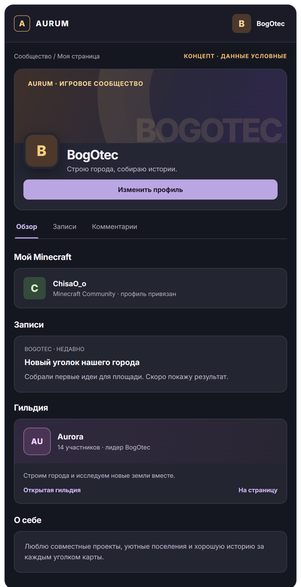
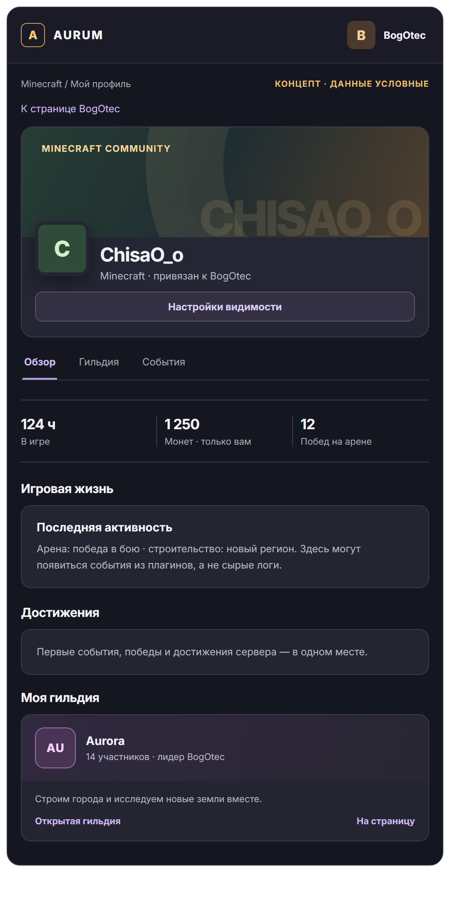
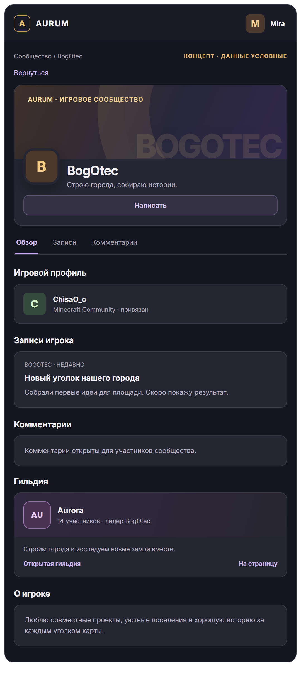
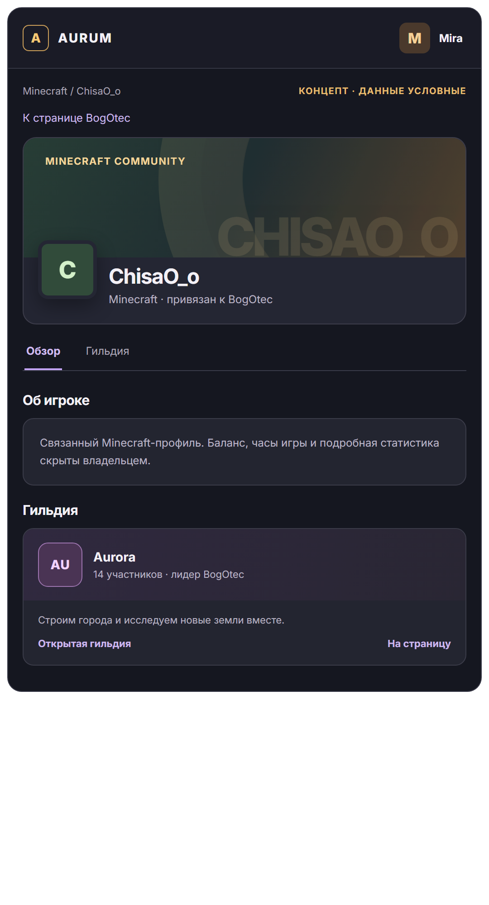
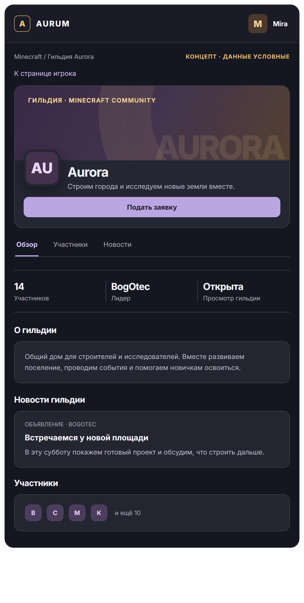

# Профили игроков и гильдий — эскиз

Это концепция интерфейса, не действующие страницы сайта. Имена, записи и цифры на изображениях условные.

## Своя страница

## Как видит другой вошедший пользователь

## Гильдия

Мини-карточка гильдии с названием, аватаром, описанием и числом участников повторяется на странице игрока и в Minecraft-профиле. Она ведёт на отдельную страницу гильдии. Загруженный лидером аватар заменяет буквенный герб-заглушку.

Предполагаемая приватность: страницы и комментарии доступны вошедшим пользователям; email, баланс и подробная игровая статистика другого игрока скрыты по умолчанию. Гильдии видны в каталоге, но лидер сможет ограничить просмотр состава и расширенных сведений. Права на публикацию в ленте гильдии задаются отдельно.

Чтобы сделать эти экраны живыми, ещё нужны Aurum Link, чтение данных Minecraft/Core/Guilds/Arena, настройки приватности, загрузка аватара гильдии и публикации с модерацией.
